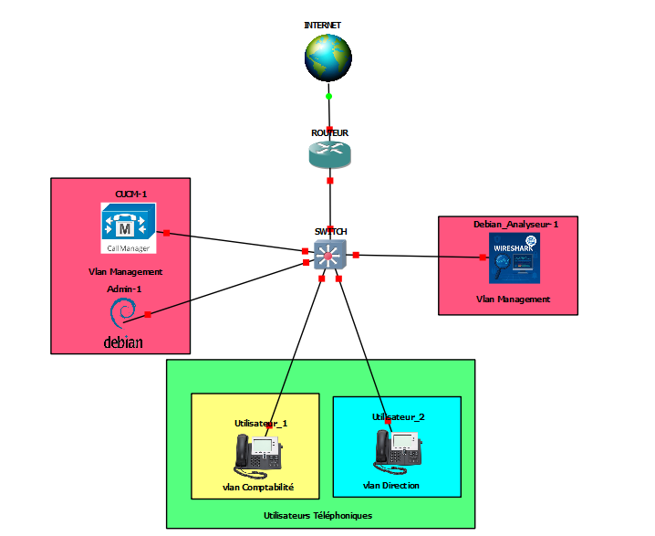
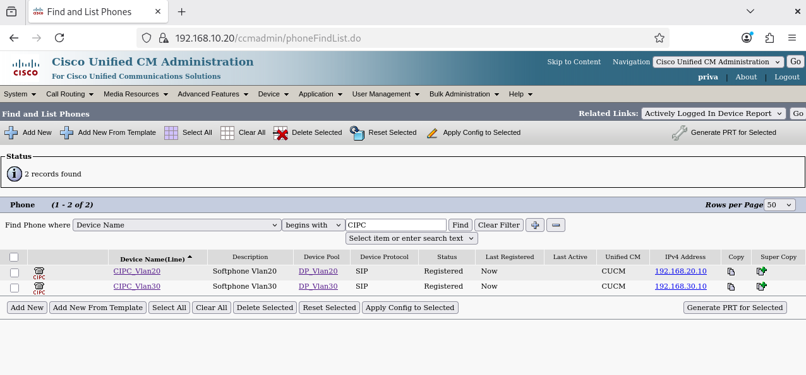
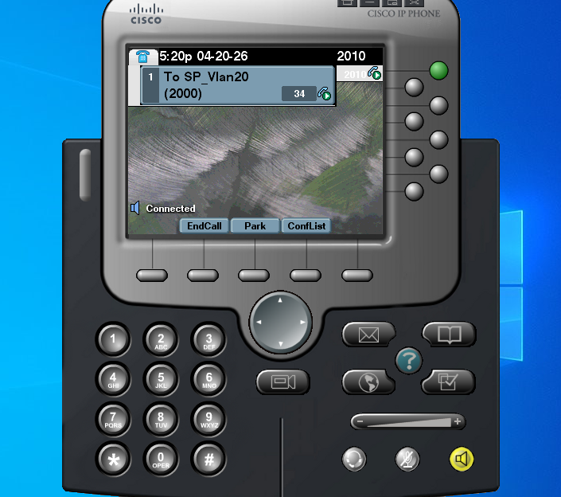
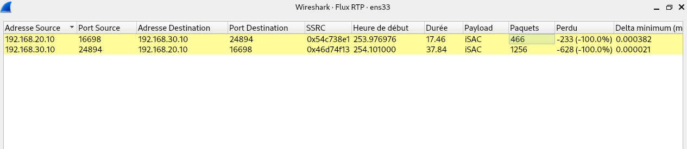
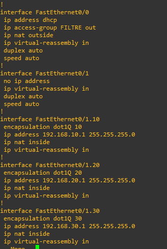
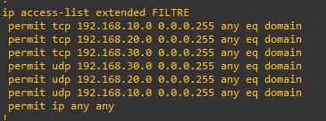
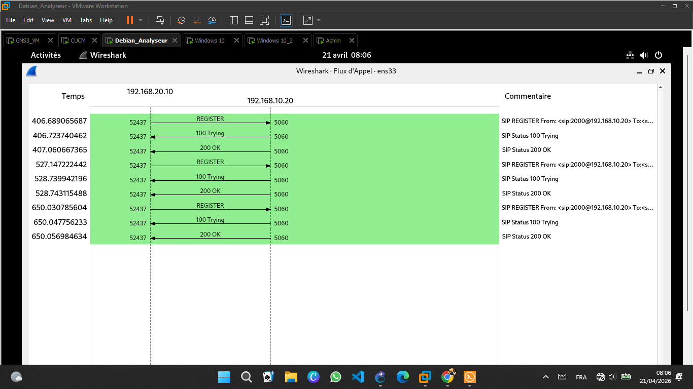
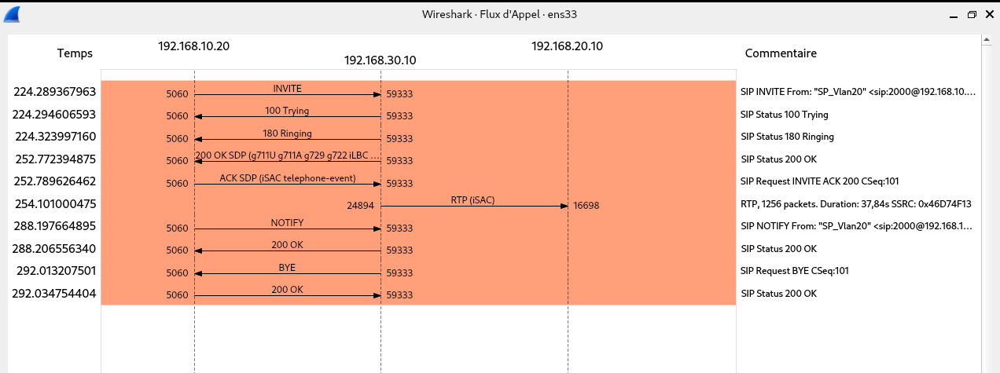

# ☎️ Déploiement VoIP/ToIP , Cisco Unified Communications Manager

**Déploiement, sécurisation et supervision d'une infrastructure VoIP professionnelle en environnement virtualisé**, autour d'un serveur Cisco Unified Communications Manager (CUCM). 


📄 **[Rapport complet (PDF)](docs/rapport-voip-cucm.pdf)** : cadre théorique (VoIP, SIP, RTP/RTCP, QoS, sécurité), architecture détaillée, mise en œuvre pas à pas et bibliographie complète.

---

## 📌 Contexte

La convergence voix-données introduit des contraintes que la téléphonie classique ne connaît pas : latence, gigue, perte de paquets, et une exposition à des menaces réseau spécifiques (écoute des flux RTP, détournement de session SIP, déni de service). Ce projet répond à la problématique suivante :

> Comment déployer, sécuriser et superviser une infrastructure VoIP professionnelle en environnement virtualisé, en garantissant la confidentialité des communications, la qualité de service et la détection des menaces réseau ?

Six objectifs opérationnels structurent le projet : mise en place de l'architecture réseau, déploiement d'un serveur de téléphonie, implémentation d'une politique de Qualité de Service (QoS), chiffrement de bout en bout (SRTP/TLS), capture et analyse du trafic et détection d'intrusion (IDS).

## 🖥️ Aperçu

| Topologie réseau | Softphones enregistrés dans le CUCM |
|---|---|
|  |  |

| Appel établi entre les deux softphones | Analyse du flux RTP (Wireshark) |
|---|---|
|  |  |

## 🌐 Architecture réseau

Segmentation en trois VLANs, interconnectés par un routeur Cisco en **router-on-a-stick** :

| VLAN | Désignation | Sous-réseau | Rôle |
|---|---|---|---|
| VLAN 10 | Management VoIP | 192.168.10.0/24 | Héberge le CUCM et la machine d'analyse Wireshark/Suricata |
| VLAN 20 | Softphone 1 | 192.168.20.0/24 | Premier softphone CIPC |
| VLAN 30 | Softphone 2 | 192.168.30.0/24 | Second softphone CIPC |

## 🛠️ Équipements et logiciels

| Composant | Version / Modèle | Rôle |
|---|---|---|
| CUCM | Cisco UCM 14.0 | Serveur de téléphonie, Proxy SIP, Registrar |
| Routeur | Cisco IOS c3725 | Routage inter-VLAN, QoS (LLQ) |
| Switch | Cisco IOS c3750 | Commutation L2, port SPAN, dot1Q |
| Softphones | CIPC 7.x | Clients SIP : extensions 2000 / 2010 |
| Machine d'analyse | Debian | Wireshark + Suricata |

## ⚙️ Mise en œuvre

### 1. Réseau de base : VLANs, routage inter-VLAN, NAT, ACL

Le routeur assure le routage inter-VLAN via des sous-interfaces dot1Q, la traduction NAT et applique une ACL de filtrage restreignant le trafic DNS sortant par VLAN.




### 2. Qualité de service — LLQ + marquage DSCP

Politique QoS appliquée en sortie de chaque sous-interface, avec file d'attente à faible latence (LLQ) dédiée au trafic voix :

```
class-map match-all CM-VOIX-RTP
 match access-group name ACL-VOIX-RTP
class-map match-all CM-SIP
 match access-group name ACL-SIP
!
policy-map PM-QOS-VOIP
 class CM-VOIX-RTP
  priority 512
  set dscp ef
 class CM-SIP
  bandwidth 128
  set dscp cs3
 class class-default
  fair-queue
  set dscp default
```

- Flux **RTP** → `priority 512` + DSCP **EF (46)** : priorité absolue
- Signalisation **SIP** → `bandwidth 128` + DSCP **CS3 (24)** : priorité intermédiaire

Validé par `show policy-map interface` pendant un appel actif : les paquets RTP sont bien classifiés dans la Priority Queue.

### 3. Serveur de téléphonie : CUCM 14

- Services activés via Cisco Unified Serviceability : **Cisco CallManager**, **Cisco TFTP**, **Cisco SIP Proxy**
- Deux Device Pools (`DP-VLAN20`, `DP-VLAN30`) associés à une région configurée en codec **G.711** (64 kbps)
- Directory Numbers **2000** et **2010** attribués aux softphones : appels internes directs sans Route Pattern
- Deux Phone Security Profiles : `CIPC-SIP-NonSecure` (port 5060) pour la phase initiale, `CIPC-SIP-Encrypted` (TLS port 5061, SRTP) pour la phase de chiffrement

### 4. Softphones CIPC

Cisco IP Communicator installé sur deux VM Windows 10, pointant vers le CUCM comme serveur TFTP et SIP Registrar. Chaque softphone télécharge son fichier de configuration XML au démarrage et s'enregistre auprès du CUCM (statut **Registered**).

### 5. Station d'analyse

Machine Debian déployée sur le VLAN 10 (192.168.10.10), connectée au port SPAN du switch pour capturer passivement l'ensemble du trafic inter-VLAN sans perturber les communications.

## 📊 Résultats et analyse

- **Enregistrement SIP** validé : les deux softphones apparaissent `Registered` dans la console CUCM
- **Appels bidirectionnels** établis avec succès, transmission audio G.711 confirmée entre VLANs

| Séquence SIP : enregistrement (REGISTER → 200 OK) | Séquence SIP : appel (INVITE → BYE) |
|---|---|
|  |  |

- Capture Wireshark confirmant que **la signalisation SIP transite intégralement en clair** (en-têtes, adresses IP des endpoints, corps SDP lisibles), point de départ justifiant la nécessité du chiffrement TLS/SRTP
- Flux RTP analysés via *Telephony → RTP Streams* : suivi des paquets transmis, pertes et gigue en temps réel, avec possibilité de réécoute via RTP Player
- QoS validée : classification correcte des paquets RTP en Priority Queue avec marquage DSCP EF

## ⚠️ Limites du projet

- Signalisation SIP et flux RTP **non chiffrés** dans cette phase (TLS/SRTP identifiés comme axe d'amélioration, non encore implémentés)
- Pas d'IDS déployé pour la détection d'attaques VoIP spécifiques (scan SIP, flood INVITE)
- Environnement de laboratoire virtualisé, non testé sur infrastructure physique de production

## 🔭 Perspectives

- Chiffrement de bout en bout : **TLS** (port 5061) pour la signalisation SIP, **SRTP** (AES-128 + HMAC-SHA1) pour le flux audio
- Déploiement de **Suricata** (IDS/IPS) pour la détection d'attaques VoIP : scan SIP, flood SIP INVITE, enregistrements non autorisés
- Stack cible : **CUCM 14 + SIP + QoS LLQ + SRTP/TLS + Suricata**, couvrant qualité de service, confidentialité et détection des menaces


## 👤 Auteur

**Priva EKORE MINANG**
Étudiant en Licence Professionnelle Réseaux et Systèmes Numériques à INPTIC, Libreville
A la recherche d'un stage Académique de 3 mois 


[LinkedIn](https://linkedin.com/in/priva-ekore-minang) · [GitHub](https://github.com/privaekoreminang)
